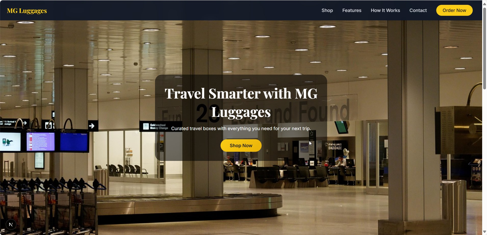

# 🧳 MG Luggages – Premium Travel Boxes & Suitcases




**MG Luggages** is a premium **Next.js web application** built to showcase and sell **luxury travel boxes and suitcases**.  
Designed with **elegance, durability, and a mobile-first approach**, the app provides a **premium shopping experience** for modern travelers.  

---

## ✨ Features


- 🌐 **Landing Page** – Luxury hero section with premium imagery  
- 🧭 **Responsive Navigation** – Mobile hamburger & desktop right-aligned links  
- 🎨 **Premium UI/UX** – Glassmorphism, gold accents, luxury fonts  
- 📦 **Products Showcase** – Highlight premium luggage collections  
- 🛠 **SCSS Modules** – Clean component-level styling  
- 📱 **Mobile-First Design** – Optimized for phones & tablets  
- 🔑 **Strong Call-to-Action (CTA)** – “Order Now” buttons to drive sales  
- 🖋 **SEO Optimized** – Metadata for search engines & social sharing  

---

## 📂 Project Structure


---

## 🎨 Design System

### Colors


- **Gold** (`#FACC15`, `#FDE047`) – Premium accents & CTAs  
- **Charcoal** (`#111827`, `#1F2937`) – Hero & dark sections  
- **Off-White** (`#F9FAFB`) – Light backgrounds  
- **Slate Gray** (`#374151`, `#D1D5DB`) – Secondary text & borders  

### Fonts


- [Playfair Display](https://fonts.google.com/specimen/Playfair+Display) – Luxury headings  
- [Inter](https://fonts.google.com/specimen/Inter) – Clean body text  

---

## 📸 Screenshots

Here are some example previews of the app:

- **Hero Section**
  

- **Products Section**
  

- **Mobile View**
  

---

## 🚀 Getting Started


### Prerequisites
- Node.js 18+  
- npm or yarn  

### Setup

1. **Clone the repo**
   ```bash
   git clone https://github.com/Dmuse-project/mg-luggugages.git
   cd mg-luggages